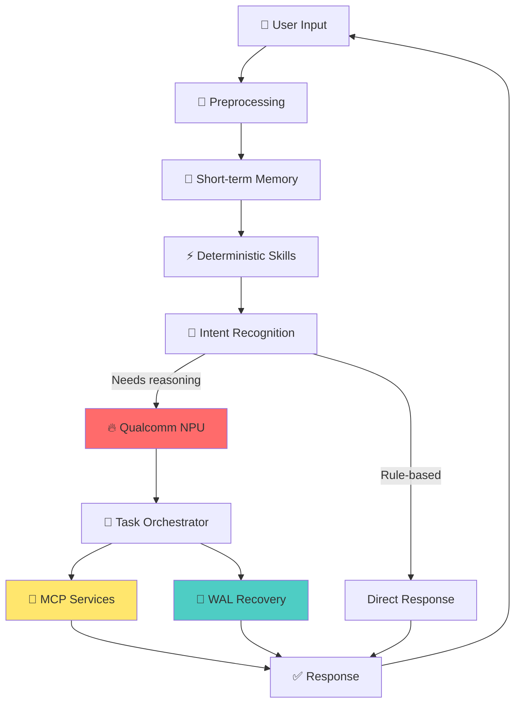
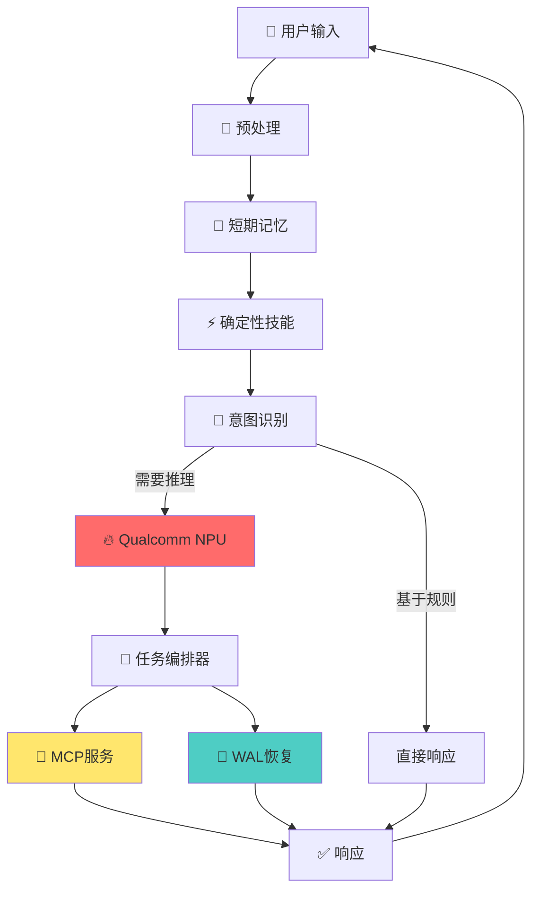

# 🚀 Sparx

> **High-performance AI Agent framework for edge devices**  
> Run intelligent agents entirely on Qualcomm NPU. Zero cloud dependency. Sub-100ms latency. Production-ready.

[](LICENSE)
[]()
[](https://github.com/OpenSparX/MasterAgent/actions)

[English](#english) | [中文](#中文)

---

<a name="english"></a>

## Why Sparx?

**Edge AI is the future.** Cloud-based agents suffer from high latency, privacy concerns, and API costs. Sparx brings the entire agent execution pipeline to your device — powered by Qualcomm's NPU.

### Core Advantages

- ⚡ **10-100x faster**: NPU acceleration + no network round-trip → sub-100ms response
- 🔒 **Private by default**: All data stays on-device, zero cloud exposure
- 💰 **Cost-effective**: No API fees, no cloud infrastructure
- 🚗 **Production-ready**: Built for safety-critical scenarios (automotive, IoT, robotics)
- 🛡️ **Fault-tolerant**: WAL recovery + Unknown terminal state — no silent failures

### vs Cloud-Based Frameworks

| Feature | Sparx | LangChain | AutoGPT |
|---------|-------|-----------|---------|
| **Latency** | <100ms | 2-5s | 5-30s |
| **Privacy** | On-device | Cloud | Cloud |
| **Offline** | ✅ Full support | ❌ Requires API | ❌ Requires API |
| **Cost** | $0 | ~$0.01/call | ~$0.05/call |
| **NPU Acceleration** | ✅ Qualcomm QNN | ❌ | ❌ |
| **Crash Recovery** | ✅ WAL + Unknown state | ❌ | ❌ |

---

## Quick Start

### Installation

**Option 1: curl (macOS / Linux)**
```bash
curl -fsSL https://raw.githubusercontent.com/OpenSparX/MasterAgent/main/scripts/install.sh | sh
```

**Option 2: Homebrew (macOS)**
```bash
brew install OpenSparX/masteragent/sparx
```

**Option 3: npm**
```bash
npm install -g @sparx/cli
```

### 30-Second Demo

```bash
# Create a new agent project
sparx init my-agent
cd my-agent

# Run automotive voice assistant demo
sparx demo automotive

# Output:
# 🚗 Automotive Voice Assistant Demo
# ━━━━━━━━━━━━━━━━━━━━━━━━━━━━━━━━━
# User: "Turn on AC, set to 22°C, interior mode"
# 
# Processing... ⚙️
# ├─ Intent: climate_control ✓
# ├─ Skills: ac.power, ac.temperature, ac.circulation ✓
# ├─ MCP Services: vehicle.climate [87ms] ✓
# └─ Result: Climate control updated ✓
# 
# ⚡ Latency: 87ms (Qualcomm NPU accelerated)
```

---

## Architecture



### Key Components

- **Preprocessing**: Input validation, UTF-8 normalization, parameter extraction
- **Memory**: Short-term context management (conversation history, user preferences)
- **Skills**: Deterministic pattern matching — no model call when rules suffice
- **Qualcomm NPU**: Hardware-accelerated inference via QNN SDK
- **MCP Services**: Modular capabilities (vehicle control, navigation, smart home, etc.)
- **WAL Recovery**: Write-Ahead Logging for crash recovery — **industry-first Unknown terminal state**

---

## What Makes Sparx Different?

### 1. Unknown Terminal State (Unique to Sparx)

**The Problem**: What happens when your agent crashes mid-payment?

- **LangChain**: Retries → may charge twice 💸💸
- **AutoGPT**: Ignores → money lost silently 💸❓
- **Sparx**: Enters `UNKNOWN` state → requires explicit reconciliation ✅

```bash
sparx demo crash

# Simulates power loss during payment
# Output:
#   ⚠️  payment.charge → side_effect=UNKNOWN
#   idempotency_key: a3f1c7e2
#   amount: 49.99 CNY
#   
#   → Requires manual reconciliation (sparx reconcile)
#   
#   Why this matters:
#   - Retrying may duplicate the charge
#   - Ignoring may lose the money
#   - UNKNOWN is the only honest answer
```

**Read more**: [docs/WAL_RECOVERY.md](docs/WAL_RECOVERY.md)

### 2. Qualcomm NPU Acceleration

Sparx integrates with Qualcomm's QNN SDK for hardware-accelerated inference:

- **10-100x faster** than CPU-only frameworks
- **Lower power consumption** — critical for automotive/IoT
- **Supports SA8155, SA8295, SA8650** and future Snapdragon platforms

**Performance Comparison** (Qwen2-4B model):

| Platform | Backend | Latency | Power |
|----------|---------|---------|-------|
| Sparx + QNN NPU | HTP (NPU) | **87ms** | **2.3W** |
| llama.cpp (CPU) | ARM Neon | 1,240ms | 8.1W |
| LangChain (Cloud) | OpenAI API | 2,500ms+ | N/A |

### 3. Developer Experience

```bash
# Initialize project
sparx init my-agent

# Generated structure:
# my-agent/
# ├── agent.yaml          # Agent configuration
# ├── skills/
# │   └── hello.yaml      # Skill definitions
# └── .sparx/
#     └── wal.log         # Recovery log

# Run locally
sparx run

# Build and validate execution plans
sparx plan show plans/turn-off-ac.yaml
sparx plan export plans/route.yaml --format=mermaid

# Deploy to device
sparx devices              # List connected devices
sparx deploy --device 1    # Deploy to SA8295 board

# Interactive session
sparx shell
```

---

## Examples

### Automotive Voice Assistant
```bash
git clone https://github.com/OpenSparX/MasterAgent.git
cd examples/automotive_assistant
sparx run

# Supported commands:
# - "Turn on AC, set to 22°C"
# - "Navigate to nearest charging station"
# - "Play my favorite playlist"
# - "Call John"
```

### Smart Home Control
```bash
cd examples/smart_home
sparx run

# Controls lights, temperature, security via MCP services
```

### IoT Edge Agent
```bash
cd examples/iot_edge
sparx run --low-power

# Optimized for battery-powered devices
```

---

## Roadmap

- [x] Core Agent framework (v2.0)
- [x] Qualcomm QNN NPU integration
- [x] MCP service orchestration
- [x] WAL recovery + Unknown terminal state
- [x] CLI tool (init/run/deploy/doctor)
- [ ] Multi-modal input (camera, LiDAR, radar) — **Q3 2026**
- [ ] Distributed agent orchestration — **Q4 2026**
- [ ] Edge-cloud hybrid mode — **2027**
- [ ] Support for more platforms (NVIDIA Jetson, Rockchip) — **2027**

---

## Documentation

- [System Overview](docs/SYSTEM_OVERVIEW.md) — Architecture deep-dive
- [Build and Test](docs/BUILD_AND_TEST.md) — Compilation guide
- [WAL Recovery](docs/WAL_RECOVERY.md) — Crash recovery mechanism
- [MCP Services](docs/MCP_SERVICES.md) — How to add custom capabilities
- [Qualcomm NPU](docs/QUALCOMM_NPU.md) — QNN SDK integration guide

---

## Contributing

We welcome contributions! See [CONTRIBUTING.md](CONTRIBUTING.md) for guidelines.

**Good First Issues**: https://github.com/OpenSparX/MasterAgent/labels/good%20first%20issue

---

## License

Apache 2.0 — see [LICENSE](LICENSE)

---

## Community

- 💬 Discussions: [GitHub Discussions](https://github.com/OpenSparX/MasterAgent/discussions)
- 🐛 Issues: [GitHub Issues](https://github.com/OpenSparX/MasterAgent/issues)
- 📧 Email: dev@openschbrid.com

---

<a name="中文"></a>

# 🚀 Sparx

> **面向边缘设备的高性能AI Agent框架**  
> 完全运行在Qualcomm NPU上的智能Agent。无云依赖。亚百毫秒延迟。生产可用。

---

## 为什么选择Sparx？

**端侧AI是未来趋势。** 云端Agent存在高延迟、隐私隐患和API成本问题。Sparx将整个Agent执行流程搬到设备端——由Qualcomm NPU驱动。

### 核心优势

- ⚡ **快10-100倍**：NPU加速 + 无网络往返 → 亚百毫秒响应
- 🔒 **默认隐私保护**：所有数据留在设备本地，零云端暴露
- 💰 **成本极低**：无API费用，无云基础设施
- 🚗 **生产可用**：为安全关键场景设计（车载、IoT、机器人）
- 🛡️ **容错能力强**：WAL恢复 + Unknown终态 — 无静默失败

### vs 云端框架

| 特性 | Sparx | LangChain | AutoGPT |
|------|-------|-----------|---------|
| **延迟** | <100ms | 2-5秒 | 5-30秒 |
| **隐私** | 本地 | 云端 | 云端 |
| **离线** | ✅ 完全支持 | ❌ 需要API | ❌ 需要API |
| **成本** | $0 | ~$0.01/次 | ~$0.05/次 |
| **NPU加速** | ✅ Qualcomm QNN | ❌ | ❌ |
| **崩溃恢复** | ✅ WAL + Unknown状态 | ❌ | ❌ |

---

## 快速开始

### 安装

**方式1：curl（macOS / Linux）**
```bash
curl -fsSL https://raw.githubusercontent.com/OpenSparX/MasterAgent/main/scripts/install.sh | sh
```

**方式2：Homebrew（macOS）**
```bash
brew install OpenSparX/masteragent/sparx
```

**方式3：npm**
```bash
npm install -g @sparx/cli
```

### 30秒演示

```bash
# 创建新Agent项目
sparx init my-agent
cd my-agent

# 运行车载语音助手演示
sparx demo automotive

# 输出：
# 🚗 Automotive Voice Assistant Demo
# ━━━━━━━━━━━━━━━━━━━━━━━━━━━━━━━━━
# 用户："打开空调，设置22度，内循环模式"
# 
# 处理中... ⚙️
# ├─ 意图识别: climate_control ✓
# ├─ 技能匹配: ac.power, ac.temperature, ac.circulation ✓
# ├─ MCP服务: vehicle.climate [87ms] ✓
# └─ 结果: 气候控制已更新 ✓
# 
# ⚡ 延迟: 87ms（Qualcomm NPU加速）
```

---

## 架构设计



### 核心组件

- **预处理层**：输入验证、UTF-8规范化、参数提取
- **记忆管理**：短期上下文管理（对话历史、用户偏好）
- **技能系统**：确定性模式匹配 — 规则能闭合时不调用模型
- **Qualcomm NPU**：通过QNN SDK实现硬件加速推理
- **MCP服务**：模块化能力（车控、导航、智能家居等）
- **WAL恢复**：Write-Ahead Logging崩溃恢复 — **业界首创Unknown终态**

---

## Sparx的差异化特性

### 1. Unknown终态（Sparx独有）

**问题场景**：Agent在支付过程中崩溃怎么办？

- **LangChain**：重试 → 可能重复扣费 💸💸
- **AutoGPT**：忽略 → 钱静默丢失 💸❓
- **Sparx**：进入`UNKNOWN`状态 → 要求显式对账 ✅

```bash
sparx demo crash

# 模拟支付过程中断电
# 输出：
#   ⚠️  payment.charge → side_effect=UNKNOWN
#   幂等键: a3f1c7e2
#   金额: 49.99 CNY
#   
#   → 需要手动对账（sparx reconcile）
#   
#   为什么重要：
#   - 重试可能导致重复扣费
#   - 忽略可能导致钱丢失
#   - UNKNOWN是唯一诚实的答案
```

**详细文档**：[docs/WAL_RECOVERY_zh-CN.md](docs/WAL_RECOVERY_zh-CN.md)

### 2. Qualcomm NPU硬件加速

Sparx集成Qualcomm QNN SDK实现硬件加速推理：

- **比CPU快10-100倍**
- **更低功耗** — 车载/IoT场景关键指标
- **支持SA8155、SA8295、SA8650**及未来Snapdragon平台

**性能对比**（Qwen2-4B模型）：

| 平台 | 后端 | 延迟 | 功耗 |
|------|------|------|------|
| Sparx + QNN NPU | HTP (NPU) | **87ms** | **2.3W** |
| llama.cpp (CPU) | ARM Neon | 1,240ms | 8.1W |
| LangChain (云端) | OpenAI API | 2,500ms+ | N/A |

### 3. 开发者体验

```bash
# 初始化项目
sparx init my-agent

# 生成的项目结构：
# my-agent/
# ├── agent.yaml          # Agent配置
# ├── skills/
# │   └── hello.yaml      # 技能定义
# └── .sparx/
#     └── wal.log         # 恢复日志

# 本地运行
sparx run

# 构建和验证执行计划
sparx plan show plans/turn-off-ac.yaml
sparx plan export plans/route.yaml --format=mermaid

# 部署到设备
sparx devices              # 列出已连接设备
sparx deploy --device 1    # 部署到SA8295开发板

# 交互式会话
sparx shell
```

---

## 示例项目

### 车载语音助手
```bash
git clone https://github.com/OpenSparX/MasterAgent.git
cd examples/automotive_assistant
sparx run

# 支持的命令：
# - "打开空调，设置22度"
# - "导航到最近的充电站"
# - "播放我最喜欢的歌单"
# - "给张三打电话"
```

### 智能家居控制
```bash
cd examples/smart_home
sparx run

# 通过MCP服务控制灯光、温度、安防
```

### IoT边缘Agent
```bash
cd examples/iot_edge
sparx run --low-power

# 针对电池供电设备优化
```

---

## 路线图

- [x] 核心Agent框架 (v2.0)
- [x] Qualcomm QNN NPU集成
- [x] MCP服务编排
- [x] WAL恢复 + Unknown终态
- [x] CLI工具 (init/run/deploy/doctor)
- [ ] 多模态输入（摄像头、LiDAR、雷达）— **2026 Q3**
- [ ] 分布式Agent编排 — **2026 Q4**
- [ ] 端云混合模式 — **2027**
- [ ] 支持更多平台（NVIDIA Jetson、Rockchip）— **2027**

---

## 文档

- [系统概述](docs/01_系统概述.md) — 架构深度解析
- [构建和测试](docs/10_构建运行与测试.md) — 编译指南
- [WAL恢复机制](docs/WAL_RECOVERY_zh-CN.md) — 崩溃恢复原理
- [MCP服务](docs/MCP_SERVICES_zh-CN.md) — 如何添加自定义能力
- [Qualcomm NPU](docs/QUALCOMM_NPU_zh-CN.md) — QNN SDK集成指南

---

## 贡献指南

欢迎贡献！请查看[CONTRIBUTING_zh-CN.md](CONTRIBUTING_zh-CN.md)了解详情。

**新手友好Issue**：https://github.com/OpenSparX/MasterAgent/labels/good%20first%20issue

---

## 许可证

Apache 2.0 — 详见[LICENSE](LICENSE)

---

## 社区

- 💬 讨论区：[GitHub Discussions](https://github.com/OpenSparX/MasterAgent/discussions)
- 🐛 问题反馈：[GitHub Issues](https://github.com/OpenSparX/MasterAgent/issues)
- 📧 邮箱：dev@openschbrid.com

---

## Supported Platforms

| Platform | SoC | Status | Notes |
|----------|-----|--------|-------|
| Automotive | SA8155P | ✅ Supported | Gen 3 |
| Automotive | SA8295P | ✅ Supported | Gen 4 |
| Automotive | SA8650P | ✅ Supported | Gen 4+ |
| Automotive | SA8775P | 🔄 Testing | Gen 4 |
| Mobile | Snapdragon 8 Gen 3 | 🔄 Planned | 2027 |
| IoT | QCS6490 | 🔄 Planned | 2027 |

---

## FAQ

**Q: Do I need Qualcomm QNN SDK to run Sparx?**  
A: For development and testing, no. Sparx includes a Mock mode using llama.cpp (CPU inference). For production deployment with NPU acceleration, you need QNN SDK from Qualcomm.

**Q: 我需要Qualcomm QNN SDK才能运行Sparx吗？**  
A: 开发和测试不需要。Sparx包含Mock模式，使用llama.cpp（CPU推理）。生产部署需要NPU加速时，需要从Qualcomm获取QNN SDK。

**Q: What models are supported?**  
A: Currently tested with Qwen2-4B and Qwen3-4B. Any GGUF model compatible with llama.cpp should work in Mock mode. For NPU, models need to be converted to QNN format.

**Q: 支持哪些模型？**  
A: 目前测试过Qwen2-4B和Qwen3-4B。Mock模式支持任何llama.cpp兼容的GGUF模型。NPU模式需要将模型转换为QNN格式。

**Q: Is this production-ready?**  
A: Yes. The v2.0 core has been tested in automotive scenarios with 15 test suites covering crash recovery, concurrency, and fault injection.

**Q: 这是生产可用的吗？**  
A: 是的。v2.0核心已在车载场景测试，包含15个测试套件覆盖崩溃恢复、并发和故障注入。

---

**Star this repo if you believe edge AI is the future! ⭐**

**如果您相信端侧AI是未来，请给我们一个Star！⭐**
