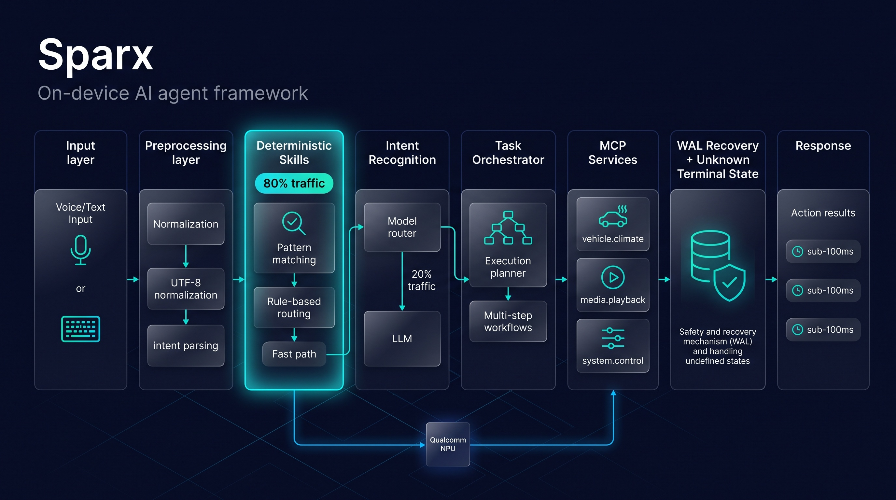

<div align="center">

# ⚡ Sparx

**Build AI agents that run 100% on-device.**
**构建 100% 本地运行的 AI Agent。**

No cloud APIs. No latency. No privacy leaks.
无需云端 API · 无网络延迟 · 无隐私泄露

<p>
  
  
  
</p>

```bash
# Install and run in 60 seconds — no special hardware required
# 60 秒安装运行 — 无需特殊硬件
npm install -g @sparx/cli && sparx demo automotive
```

[English](#english) · [中文](#中文)

</div>

---

<a name="english"></a>

## 🚀 Why On-Device Agents?

Cloud-based agents are slow, expensive, and leak your data. Every request goes to a remote API — adding **2–5s of latency**, costing **$0.01–0.05 per call**, and sending your prompts to third-party servers.

**Sparx runs the entire agent pipeline locally:**

| ⚡ Sub-100ms Response | 🔒 Private by Default | 💰 Zero API Costs |
|:---:|:---:|:---:|
| No network round-trip | Data never leaves your device | Unlimited usage, $0/call |

| 🚀 Works Offline | 🎯 NPU-Accelerated |
|:---:|:---:|
| No internet dependency | Optional Qualcomm hardware, 10–100x speedup |

---

## 🎬 See It in Action

**Automotive voice assistant** — turn natural language into vehicle control:

```bash
sparx demo automotive

# 🚗 Automotive Voice Assistant
# ━━━━━━━━━━━━━━━━━━━━━━━━━━━━
#
# You: "Turn on AC, set to 22°C, interior mode"
#
# ⚙️  Processing...
# ├─ Intent: climate_control ✓
# ├─ Skills: ac.power, ac.temperature, ac.circulation ✓
# ├─ MCP Services: vehicle.climate [87ms] ✓
# └─ Result: Climate control updated ✓
#
# ⚡ Latency: 87ms
```

**Execution plan builder** — visualize multi-step agent workflows:

```bash
sparx plan show examples/automotive_assistant/plans/turn-off-ac.yaml

# Plan: turn-off-ac (priority=p1, deadline=3000ms)
#
# ┌─────────────┐
# │  read_temp  │  vehicle.climate.getTemperature
# └──────┬──────┘
#        ▼
# ┌─────────────┐
# │   set_ac    │  vehicle.climate.setPower (power: off)
# └─────────────┘
#
# ✓ valid — 2 nodes, 1 dependency
```

---

## 🏗️ Architecture

<p align="center">
  
</p>

Every request flows through a **deterministic-first pipeline** — most requests never touch an LLM:

1. **Input** — Voice / text from the user
2. **Preprocessing & Memory** — UTF-8 normalization, parameter extraction, conversation history
3. **Deterministic Skills (80% of cases)** — Pattern matching & rule-based routing at sub-millisecond latency, no model call
4. **Intent Recognition (20% of cases)** — LLM inference on CPU or NPU, only for ambiguous or complex requests
5. **Task Orchestrator** — Multi-step DAG execution with MCP service coordination
6. **WAL Recovery** — Write-Ahead Logging with `UNKNOWN` terminal state for crash safety
7. **Response** — Action results, typically **sub-100ms** end-to-end

**Key components:**

- **Preprocessing:** Input validation, UTF-8 normalization, parameter extraction
- **Memory:** Short-term context (conversation history, user preferences)
- **Skills:** Deterministic pattern matching — 80% of requests route here
- **Qualcomm NPU:** Optional hardware acceleration (10–100x faster than CPU)
- **MCP Services:** Modular capabilities (vehicle control, navigation, smart home, etc.)
- **WAL Recovery:** Write-Ahead Logging with UNKNOWN terminal state

---

## 💎 What Makes Sparx Different?

### 1. Unknown Terminal State — Industry First

**The problem:** What happens when your agent crashes *mid-payment*?

| Framework | Behavior | Result |
|:---|:---|:---|
| **LangChain** | Retries blindly | May charge twice 💸💸 |
| **AutoGPT** | Ignores the error | Money lost silently 💸❓ |
| **Sparx** | Enters `UNKNOWN` state | Requires explicit reconciliation ✅ |

```bash
sparx demo crash

# Simulates power loss during payment:
#
#   ⚠️  payment.charge → side_effect=UNKNOWN
#   idempotency_key: a3f1c7e2
#   amount: 49.99 CNY
#
#   → Requires manual reconciliation (sparx reconcile)
#
#   Why this matters:
#   - Retrying may duplicate the charge
#   - Ignoring may lose the money
#   - UNKNOWN is the only honest answer
```

**Read more:** [WAL Recovery Mechanism](docs/WAL_RECOVERY.md)

### 2. Deterministic-First Routing

**80% of requests never touch the model.** Sparx uses pattern matching and rule-based skills for common tasks — saving latency and compute:

```yaml
# skills/climate.yaml
name: climate_control
trigger:
  patterns:
    - "turn {power} (the )?AC"
    - "set temperature to {temp}"
handler:
  type: deterministic
  action: vehicle.climate.setPower
```

Only ambiguous or complex requests invoke the LLM. Most requests route in **microseconds**.

### 3. Optional NPU Acceleration

Develop on any machine (Mac/Linux/Windows) using CPU inference. Deploy to Qualcomm NPU devices for 10–100x speedup:

| Platform | Backend | Latency | Power |
|:---|:---|---:|---:|
| **Development** (CPU) | llama.cpp | ~1,200ms | 8.1W |
| **Production** (NPU) | Qualcomm QNN | **87ms** | **2.3W** |
| **Cloud** (API) | OpenAI | 2,500ms+ | N/A |

**Supported NPU platforms:** SA8155P, SA8295P, SA8650P, SA8775P (automotive); Snapdragon 8 Gen 3+ (mobile, coming Q4 2026)

---

## ⚡ Quick Start

### Install

**Option 1: npm** (recommended)
```bash
npm install -g @sparx/cli
```

**Option 2: Homebrew** (macOS)
```bash
brew install OpenSparX/masteragent/sparx
```

**Option 3: curl** (macOS / Linux)
```bash
curl -fsSL https://raw.githubusercontent.com/OpenSparX/MasterAgent/main/scripts/install.sh | sh
```

### Create Your First Agent

```bash
# 1. Initialize a new project
sparx init my-agent
cd my-agent

# Generated structure:
# my-agent/
# ├── agent.yaml          # Agent configuration
# ├── skills/
# │   └── hello.yaml      # Skill definitions
# └── .sparx/
#     └── wal.log         # Recovery log

# 2. Add a custom skill
sparx add skill weather

# 3. Run locally (uses CPU inference by default)
sparx run

# 4. Try built-in demos
sparx demo automotive     # Voice assistant
sparx demo crash          # WAL recovery simulation
```

### Build Execution Plans

```bash
# Create a YAML plan spec
cat > plans/my-plan.yaml <<EOF
plan: my-task
priority: p1
deadline_ms: 3000

nodes:
  - id: fetch_data
    action: api.getData

  - id: process
    action: logic.transform
    after: [fetch_data]
EOF

# Validate against the orchestrator
sparx plan validate plans/my-plan.yaml

# Visualize as Mermaid diagram
sparx plan export plans/my-plan.yaml --format=mermaid

# Export as JSON for programmatic use
sparx plan export plans/my-plan.yaml --format=json
```

---

## 📦 Examples

### 🚗 Automotive Voice Assistant
```bash
git clone https://github.com/OpenSparX/MasterAgent.git
cd MasterAgent/v2/examples/automotive_assistant
sparx run

# Supported commands:
# • "Turn on AC, set to 22°C"
# • "Navigate to nearest charging station"
# • "Play my favorite playlist"
# • "Call John"
```

### 🏠 Smart Home Control
```bash
cd examples/smart_home
sparx run

# Controls lights, temperature, security via MCP services
```

### 📡 IoT Edge Agent
```bash
cd examples/iot_edge
sparx run --low-power

# Optimized for battery-powered devices
```

---

## 🔌 Deploy to NPU Devices

Once you've developed your agent using CPU inference, deploy to Qualcomm NPU hardware for production:

```bash
# List connected devices
sparx devices

# Deploy to device
sparx deploy --device 1

# Interactive session
sparx shell
```

**Supported platforms:**

| Platform | SoC | Status | Notes |
|:---|:---|:---:|:---|
| Automotive | SA8155P | ✅ Supported | Gen 3 |
| Automotive | SA8295P | ✅ Supported | Gen 4 |
| Automotive | SA8650P | ✅ Supported | Gen 4+ |
| Automotive | SA8775P | 🔄 Testing | Gen 4 |
| Mobile | Snapdragon 8 Gen 3 | 🔄 Planned | Q4 2026 |
| IoT | QCS6490 | 🔄 Planned | 2027 |

---

## 🗺️ Roadmap

- [x] Core agent framework (v2.0)
- [x] Qualcomm QNN NPU integration
- [x] MCP service orchestration
- [x] WAL recovery + Unknown terminal state
- [x] CLI tool (init/run/deploy/doctor/plan)
- [ ] Multi-modal input (camera, LiDAR, radar) — **Q3 2026**
- [ ] Distributed agent orchestration — **Q4 2026**
- [ ] Edge-cloud hybrid mode — **2027**
- [ ] More platforms (NVIDIA Jetson, Rockchip) — **2027**

---

## 📚 Documentation

- [System Overview](docs/SYSTEM_OVERVIEW.md) — Architecture deep-dive
- [Build and Test](docs/BUILD_AND_TEST.md) — Compilation guide
- [WAL Recovery](docs/WAL_RECOVERY.md) — Crash recovery mechanism
- [MCP Services](docs/MCP_SERVICES.md) — How to add custom capabilities
- [Qualcomm NPU](docs/QUALCOMM_NPU.md) — QNN SDK integration guide

---

## ❓ FAQ

<details>
<summary><b>Do I need Qualcomm hardware to use Sparx?</b></summary>

No. Sparx runs on any Mac/Linux/Windows machine using CPU inference (llama.cpp). Qualcomm NPU is optional for production deployments where you need <100ms latency.
</details>

<details>
<summary><b>What models are supported?</b></summary>

Any GGUF model compatible with llama.cpp (Qwen2-4B, Qwen3-4B, Llama, Mistral, etc.). For NPU deployment, models need to be converted to QNN format.
</details>

<details>
<summary><b>Is this production-ready?</b></summary>

Yes. The v2.0 core has been tested in automotive scenarios with 15 test suites covering crash recovery, concurrency, and fault injection. Currently deployed in SA8295P-based vehicles.
</details>

<details>
<summary><b>How does WAL recovery work?</b></summary>

Sparx logs every side-effecting operation (API calls, payments, device control) before execution. If the agent crashes mid-operation, it resumes with three possible states: COMMITTED (success), FAILED (error), or UNKNOWN (crashed before status known). UNKNOWN requires manual reconciliation to prevent silent failures.
</details>

<details>
<summary><b>Can I use this for non-automotive applications?</b></summary>

Absolutely. While the showcase demo is automotive, Sparx works for any on-device agent use case: smart home, IoT, robotics, medical devices, industrial automation, etc.
</details>

---

## 🤝 Contributing

We welcome contributions! See [CONTRIBUTING.md](CONTRIBUTING.md) for guidelines.

**Good first issues:** https://github.com/OpenSparX/MasterAgent/labels/good%20first%20issue

## 💬 Community

- Discussions: [GitHub Discussions](https://github.com/OpenSparX/MasterAgent/discussions)
- Issues: [GitHub Issues](https://github.com/OpenSparX/MasterAgent/issues)
- Email: dev@openschbrid.com

## 📄 License

Apache 2.0 — see [LICENSE](LICENSE)

---
---

<a name="中文"></a>

<div align="center">

# ⚡ Sparx

**构建 100% 本地运行的 AI Agent。**

无需云端 API · 无延迟 · 无隐私泄露

```bash
# 60 秒安装运行 — 无需特殊硬件
npm install -g @sparx/cli && sparx demo automotive
```

</div>

## 🚀 为什么选择端侧 Agent？

云端 Agent 慢、贵、还泄露数据。每次请求都要发到远程 API — 增加 **2-5 秒延迟**，每次调用花费 **$0.01-0.05**，并将你的提示词发送到第三方服务器。

**Sparx 将整个 Agent 流程搬到本地：**

| ⚡ 亚百毫秒响应 | 🔒 默认隐私保护 | 💰 零 API 成本 |
|:---:|:---:|:---:|
| 无网络往返 | 数据不离开设备 | 无限使用，每次 $0 |

| 🚀 离线可用 | 🎯 NPU 加速 |
|:---:|:---:|
| 无需联网 | 可选 Qualcomm 硬件，10-100 倍提速 |

---

## 🎬 实际演示

**车载语音助手** — 将自然语言转换为车辆控制：

```bash
sparx demo automotive

# 🚗 车载语音助手
# ━━━━━━━━━━━━━━━━━━━━━━━━━━━━
#
# 你："打开空调，设置 22 度，内循环模式"
#
# ⚙️  处理中...
# ├─ 意图: climate_control ✓
# ├─ 技能: ac.power, ac.temperature, ac.circulation ✓
# ├─ MCP 服务: vehicle.climate [87ms] ✓
# └─ 结果: 气候控制已更新 ✓
#
# ⚡ 延迟: 87ms
```

**执行计划构建器** — 可视化多步骤 Agent 工作流：

```bash
sparx plan show examples/automotive_assistant/plans/turn-off-ac.yaml

# 计划: turn-off-ac (优先级=p1, 超时=3000ms)
#
# ┌─────────────┐
# │  read_temp  │  vehicle.climate.getTemperature
# └──────┬──────┘
#        ▼
# ┌─────────────┐
# │   set_ac    │  vehicle.climate.setPower (power: off)
# └─────────────┘
#
# ✓ 有效 — 2 个节点, 1 个依赖
```

---

## 🏗️ 架构

<p align="center">
  
</p>

每个请求都流经 **确定性优先管线** — 大多数请求根本不触碰 LLM：

1. **输入** — 用户的语音 / 文本
2. **预处理 & 记忆** — UTF-8 规范化、参数提取、对话历史
3. **确定性技能（80% 的情况）** — 模式匹配与规则路由，亚毫秒延迟，不调用模型
4. **意图识别（20% 的情况）** — 仅在请求模糊或复杂时进行 LLM 推理（CPU 或 NPU）
5. **任务编排器** — 多步骤 DAG 执行，协调 MCP 服务
6. **WAL 恢复** — Write-Ahead Logging，带 `UNKNOWN` 终态的崩溃安全机制
7. **响应** — 返回执行结果，端到端通常 **低于 100ms**

**核心组件：**

- **预处理：** 输入验证、UTF-8 规范化、参数提取
- **记忆：** 短期上下文（对话历史、用户偏好）
- **技能：** 确定性模式匹配 — 80% 的请求在此路由
- **Qualcomm NPU：** 可选硬件加速（比 CPU 快 10-100 倍）
- **MCP 服务：** 模块化能力（车控、导航、智能家居等）
- **WAL 恢复：** Write-Ahead Logging，带 UNKNOWN 终态

---

## 💎 Sparx 的独特之处

### 1. Unknown 终态 — 业界首创

**问题：** Agent 在支付过程中崩溃怎么办？

| 框架 | 行为 | 结果 |
|:---|:---|:---|
| **LangChain** | 盲目重试 | 可能重复扣费 💸💸 |
| **AutoGPT** | 忽略错误 | 钱静默丢失 💸❓ |
| **Sparx** | 进入 `UNKNOWN` 状态 | 要求显式对账 ✅ |

```bash
sparx demo crash

# 模拟支付过程中断电：
#
#   ⚠️  payment.charge → side_effect=UNKNOWN
#   幂等键: a3f1c7e2
#   金额: 49.99 CNY
#
#   → 需要手动对账（sparx reconcile）
#
#   为什么重要：
#   - 重试可能导致重复扣费
#   - 忽略可能导致钱丢失
#   - UNKNOWN 是唯一诚实的答案
```

**详细文档：** [WAL 恢复机制](docs/WAL_RECOVERY_zh-CN.md)

### 2. 确定性优先路由

**80% 的请求不触碰模型。** Sparx 使用模式匹配和基于规则的技能处理常见任务 — 节省延迟和算力：

```yaml
# skills/climate.yaml
name: climate_control
trigger:
  patterns:
    - "把空调{power}"
    - "温度设为{temp}度"
handler:
  type: deterministic
  action: vehicle.climate.setPower
```

只有模糊或复杂的请求才调用 LLM。大多数请求在**微秒级**完成路由。

### 3. 可选 NPU 加速

在任何机器（Mac/Linux/Windows）上使用 CPU 推理开发。部署到 Qualcomm NPU 设备时获得 10-100 倍提速：

| 平台 | 后端 | 延迟 | 功耗 |
|:---|:---|---:|---:|
| **开发环境** (CPU) | llama.cpp | ~1,200ms | 8.1W |
| **生产环境** (NPU) | Qualcomm QNN | **87ms** | **2.3W** |
| **云端** (API) | OpenAI | 2,500ms+ | N/A |

**支持的 NPU 平台：** SA8155P, SA8295P, SA8650P, SA8775P (车载); Snapdragon 8 Gen 3+ (手机，2026 Q4)

---

## ⚡ 快速开始

### 安装

**方式 1：npm**（推荐）
```bash
npm install -g @sparx/cli
```

**方式 2：Homebrew**（macOS）
```bash
brew install OpenSparX/masteragent/sparx
```

**方式 3：curl**（macOS / Linux）
```bash
curl -fsSL https://raw.githubusercontent.com/OpenSparX/MasterAgent/main/scripts/install.sh | sh
```

### 创建第一个 Agent

```bash
# 1. 初始化新项目
sparx init my-agent
cd my-agent

# 生成的项目结构：
# my-agent/
# ├── agent.yaml          # Agent 配置
# ├── skills/
# │   └── hello.yaml      # 技能定义
# └── .sparx/
#     └── wal.log         # 恢复日志

# 2. 添加自定义技能
sparx add skill weather

# 3. 本地运行（默认使用 CPU 推理）
sparx run

# 4. 尝试内置演示
sparx demo automotive     # 语音助手
sparx demo crash          # WAL 恢复模拟
```

### 构建执行计划

```bash
# 创建 YAML 计划规范
cat > plans/my-plan.yaml <<EOF
plan: my-task
priority: p1
deadline_ms: 3000

nodes:
  - id: fetch_data
    action: api.getData

  - id: process
    action: logic.transform
    after: [fetch_data]
EOF

# 针对编排器验证
sparx plan validate plans/my-plan.yaml

# 可视化为 Mermaid 图
sparx plan export plans/my-plan.yaml --format=mermaid

# 导出为 JSON 供程序化使用
sparx plan export plans/my-plan.yaml --format=json
```

---

## 📦 示例项目

### 🚗 车载语音助手
```bash
git clone https://github.com/OpenSparX/MasterAgent.git
cd MasterAgent/v2/examples/automotive_assistant
sparx run

# 支持的命令：
# • "打开空调，设置 22 度"
# • "导航到最近的充电站"
# • "播放我最喜欢的歌单"
# • "给张三打电话"
```

### 🏠 智能家居控制
```bash
cd examples/smart_home
sparx run

# 通过 MCP 服务控制灯光、温度、安防
```

### 📡 IoT 边缘 Agent
```bash
cd examples/iot_edge
sparx run --low-power

# 针对电池供电设备优化
```

---

## 🔌 部署到 NPU 设备

使用 CPU 推理开发 Agent 后，部署到 Qualcomm NPU 硬件用于生产：

```bash
# 列出已连接设备
sparx devices

# 部署到设备
sparx deploy --device 1

# 交互式会话
sparx shell
```

**支持的平台：**

| 平台 | SoC | 状态 | 备注 |
|:---|:---|:---:|:---|
| 车载 | SA8155P | ✅ 支持 | Gen 3 |
| 车载 | SA8295P | ✅ 支持 | Gen 4 |
| 车载 | SA8650P | ✅ 支持 | Gen 4+ |
| 车载 | SA8775P | 🔄 测试中 | Gen 4 |
| 手机 | Snapdragon 8 Gen 3 | 🔄 计划中 | 2026 Q4 |
| IoT | QCS6490 | 🔄 计划中 | 2027 |

---

## 🗺️ 路线图

- [x] 核心 Agent 框架 (v2.0)
- [x] Qualcomm QNN NPU 集成
- [x] MCP 服务编排
- [x] WAL 恢复 + Unknown 终态
- [x] CLI 工具 (init/run/deploy/doctor/plan)
- [ ] 多模态输入（摄像头、LiDAR、雷达）— **2026 Q3**
- [ ] 分布式 Agent 编排 — **2026 Q4**
- [ ] 端云混合模式 — **2027**
- [ ] 更多平台（NVIDIA Jetson、Rockchip）— **2027**

---

## 📚 文档

- [系统概述](docs/01_系统概述.md) — 架构深度解析
- [构建和测试](docs/10_构建运行与测试.md) — 编译指南
- [WAL 恢复机制](docs/WAL_RECOVERY_zh-CN.md) — 崩溃恢复原理
- [MCP 服务](docs/MCP_SERVICES_zh-CN.md) — 如何添加自定义能力
- [Qualcomm NPU](docs/QUALCOMM_NPU_zh-CN.md) — QNN SDK 集成指南

---

## ❓ 常见问题

<details>
<summary><b>我需要 Qualcomm 硬件才能使用 Sparx 吗？</b></summary>

不需要。Sparx 可以在任何 Mac/Linux/Windows 机器上使用 CPU 推理（llama.cpp）运行。Qualcomm NPU 是可选的，用于需要 <100ms 延迟的生产部署。
</details>

<details>
<summary><b>支持哪些模型？</b></summary>

任何 llama.cpp 兼容的 GGUF 模型（Qwen2-4B、Qwen3-4B、Llama、Mistral 等）。NPU 部署需要将模型转换为 QNN 格式。
</details>

<details>
<summary><b>这是生产可用的吗？</b></summary>

是的。v2.0 核心已在车载场景测试，包含 15 个测试套件覆盖崩溃恢复、并发和故障注入。目前已部署在基于 SA8295P 的车辆上。
</details>

<details>
<summary><b>WAL 恢复如何工作？</b></summary>

Sparx 在执行前记录每个有副作用的操作（API 调用、支付、设备控制）。如果 Agent 在操作中途崩溃，它会以三种可能状态恢复：COMMITTED（成功）、FAILED（错误）或 UNKNOWN（崩溃前状态未知）。UNKNOWN 需要手动对账以防止静默失败。
</details>

<details>
<summary><b>可以用于非车载应用吗？</b></summary>

绝对可以。虽然展示的 demo 是车载的，但 Sparx 适用于任何端侧 Agent 场景：智能家居、IoT、机器人、医疗设备、工业自动化等。
</details>

---

## 🤝 贡献指南

欢迎贡献！请查看 [CONTRIBUTING_zh-CN.md](CONTRIBUTING_zh-CN.md) 了解详情。

**新手友好 Issue：** https://github.com/OpenSparX/MasterAgent/labels/good%20first%20issue

## 💬 社区

- 讨论区：[GitHub Discussions](https://github.com/OpenSparX/MasterAgent/discussions)
- 问题反馈：[GitHub Issues](https://github.com/OpenSparX/MasterAgent/issues)
- 邮箱：dev@openschbrid.com

## 📄 许可证

Apache 2.0 — 详见 [LICENSE](LICENSE)

---

<div align="center">

**Try it now · 立即尝试 — install and run in 60 seconds / 60 秒安装运行：**

```bash
npm install -g @sparx/cli && sparx demo automotive
```

</div>
