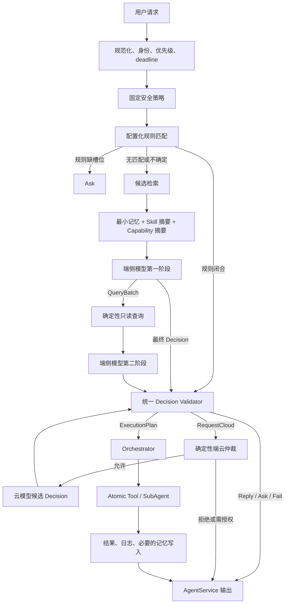

# 配置驱动 Skill 与确定性执行单元设计

> 状态：方案设计。目标是在现有 MasterAgent 上逐步形成“规则优先、检索增强、模型只做受控决策、统一执行、端云可仲裁”的架构。

## 1. 结论

整体方向正确，建议采用，但需要做四点修正：

1. **Skill 不是最小执行单元。** Skill 是可复用的任务知识、槽位规则和能力组合；最小执行单元应是经过注册、可独立鉴权和校验的 Action。
2. **模型不直接执行。** 模型、规则和分类器都只产生同一种候选 Decision；候选必须经过确定性校验器，才可交给执行器。
3. **配置驱动不等于所有逻辑配置化。** 配置负责描述、选择和约束已注册能力；Provider、权限校验、事务、幂等、取消、对账等可信逻辑仍应由代码实现。
4. **规则应该优先，但必须版本化和快照化。** 每个请求使用一个冻结配置快照，运行中更新规则不能改变已经入队的请求。

目标不是让模型“会调用 473 个接口”，而是让系统能够从能力目录中找出本次请求真正相关的少数能力，让模型只在封闭集合内输出可验证的执行决策。

## 2. 术语和最小单元

### 2.1 Capability / Tool：最小外部能力

Capability 是系统能够独立查询或执行的一项操作，例如：

- 获取当前空调风速。
- 设置前排自动风速。
- 获取当前位置。
- 开始导航。

它应具备稳定名称、输入输出 Schema、读写属性、风险等级、权限、超时、幂等策略和完成证据。它是 Provider 边界上的最小单元。

一项 Capability 是否足够“原子”，可通过以下问题判断：

- 能否独立授权？
- 能否独立校验参数？
- 能否独立确定成功、失败或未知？
- 能否独立重试或禁止重试？
- 能否明确说明产生了什么副作用？

如果不能，就不应作为底层原子 Tool 暴露。

### 2.2 Skill：可复用任务知识

Skill 不是一个接口，也不一定直接执行。它描述：

- 什么用户目标会触发它。
- 需要哪些槽位和上下文。
- 可以读取哪些状态。
- 可以使用哪些 Capability 或 SubAgent。
- 缺信息时问什么。
- 有哪些约束、风险和降级方式。
- 如何把多项能力组合成计划。

例如“座舱舒适度调节”是 Skill；“读取座舱温度”“设置空调风速”“设置循环模式”是 Capability。

### 2.3 Decision：规则或模型的封闭输出

规则和模型都只允许产生以下 Decision：

| Decision | 含义 | 后续处理 |
| --- | --- | --- |
| Reply | 直接回复 | AgentService 返回用户 |
| Ask | 缺少必要信息 | AgentService 发起反问 |
| QueryBatch | 请求一组只读信息 | QueryExecutor 校验并执行，随后进入第二阶段推理 |
| ExecutionPlan | 执行一个或多个确定性 Action | Validator 校验后交给 Orchestrator |
| RequestCloud | 申请云端处理 | CloudArbiter 决定允许、拒绝或询问授权 |
| Fail | 明确无法闭合 | 返回稳定原因码和安全提示 |

模型输出的是“候选 Decision”，不是执行事实。`RequestCloud` 也只是申请，不能等价于云端授权。

### 2.4 Action：最小内部执行单元

ExecutionPlan 中的每个 Action 只允许使用已注册类型：

| Action 类型 | 作用 | 是否产生业务副作用 |
| --- | --- | --- |
| CallTool | 调用一个本地 MCP Capability | 取决于 Tool 的读写属性 |
| DispatchAgent | 把封闭任务交给注册 SubAgent | 取决于 SubAgent 合约 |
| WaitEvent | 等待已注册事件或执行回执 | 否 |
| EmitReply | 生成计划完成后的受控回复 | 否 |

第一版不必立即实现 WaitEvent 和 EmitReply，但协议应预留扩展点。Reply、Ask、RequestCloud 和 Fail 是 Decision，不必伪装成 Orchestrator 节点。

## 3. 推荐的真实链路



### 3.1 第一层：固定安全策略

这层不应由普通配置随意覆盖，包括：

- P0 安全任务的本地闭环要求。
- 权限、隐私和数据出端底线。
- 副作用 Unknown 时禁止重复执行。
- 模型输出不能直接成为执行事实。
- Tool 和 SubAgent 必须已注册。

### 3.2 第二层：配置化规则优先

规则匹配成功时不调用模型，直接产生与模型相同的 Decision。推荐支持：

- 精确匹配。
- 规范化表达和同义词匹配。
- 有界正则与槽位抽取。
- IntentPattern 匹配。
- 优先级和互斥规则。
- 启用条件，如车型、区域、软件版本、权限和车辆状态。

规则直接执行必须同时满足：

- 唯一高置信匹配；冲突时不能按第一条规则碰运气。
- 必填槽位完整；缺失时返回 Ask。
- Action 位于规则声明的白名单。
- 参数通过目标 Capability Schema。
- 当前 Capability 可用且权限满足。

规则配置必须带版本、摘要、签名、发布时间和回滚版本。每个请求冻结规则快照，热更新只影响新请求。

### 3.3 第三层：分层召回，而不是把全部内容放进 Prompt

规则不闭合后，先做候选检索：

1. 根据用户目标召回 1～3 个业务域或二级分类。
2. 召回 3～8 个 Skill 摘要。
3. 从这些 Skill 的允许能力中召回 5～20 个 Capability 摘要。
4. 按 Skill 声明召回最小必要记忆，而不是默认携带完整历史。
5. 只提供当前请求可能需要的 ContextSource 摘要。

完整 Skill 正文、完整 Tool Schema 和敏感上下文应渐进披露：只有候选入选后才加载。这样模型规模变小、协议遵循更稳定，也避免未来 473 个 Tool 全量进入 Prompt。

### 3.4 第四层：两阶段受控推理

第一阶段使用用户当前请求、最小记忆、候选 Skill 和候选 Capability，输出：

- 已经可以闭合的最终 Decision；或者
- 一次完整 QueryBatch。

QueryBatch 只能调用配置中声明为只读的 Memory、State、Skill、Capability 查询。查询控制器负责权限、参数、并发、时效和数据裁剪。

第二阶段只接收冻结的查询结果，必须输出最终 Decision，不能继续 Query，也不能形成端侧循环。

### 3.5 第五层：统一校验和执行

无论 Decision 来自规则、端侧模型还是云端模型，都经过同一个 Validator：

- Decision Schema 和字段闭集。
- Action 类型白名单。
- Capability / SubAgent 是否存在于冻结目录。
- 参数和输出 Schema。
- 权限、风险、资源和车型可用性。
- DAG 是否无环、规模是否越界。
- deadline、幂等、重试和完成策略。
- 是否发生端云递归。

规则不能拥有一条绕过 Validator 的“快速执行通道”。规则的快速体现在不调用模型，而不是少做安全校验。

## 4. MasterAgent 配置包

对外统一称为 **MasterAgent 配置包**，官方默认目录名为 `agent-config/`。配置包身份由 `manifest.yaml` 的 `kind: MasterAgentConfigBundle`、名称和版本决定，不依赖目录名。

开源仓库提供一个开箱即用的官方 `agent-config`。用户可以直接复制为 `my-car-config`、`robot-config` 等独立配置包。正式项目推荐新建并切换独立配置包，不推荐覆盖官方默认目录，避免升级冲突并支持多车型、多客户、灰度和回滚。

一个配置包不是几个巨大文件，而是按职责拆分的资源目录：

```text
agent-config/
├── manifest.yaml
├── rules/
├── skills/
├── capabilities/
├── context_sources/
├── agents/
├── models/
├── policies/
├── prompts/
├── schemas/
└── tests/
```

人工维护的资源使用 YAML，输入输出和 Decision 契约使用 JSON Schema，较长的 Prompt/Skill 指令使用 Markdown。Loader 将它们规范化为 JSON，完成 Schema、引用、权限和冲突校验后生成不可变内部快照。

`Catalog` 只用于内部代码中的“目录快照”概念；用户面对的是一个 MasterAgent 配置包和上述直观的资源目录。

### 4.1 `rules/`（内部 RuleCatalog）

负责确定性意图匹配和槽位绑定，建议字段：

- rule_id、version、enabled、priority。
- 示例表达、模式和匹配方式。
- 必填/可选槽位、抽取器和规范化映射。
- 输出 Decision 模板。
- 允许的 Action / Skill。
- 适用条件和冲突组。
- 缺槽位时的 Ask 模板。
- 测试样例、所有者和发布时间。

当前项目已经有 `IntentRuleEntry`、摘要校验、CAS 版本更新和请求级快照，可以沿用并扩展，不需要推倒重来。

### 4.2 `skills/`（内部 SkillCatalog）

负责描述任务知识和能力组合，建议字段：

- skill_id、名称、描述、版本、启用条件。
- 触发示例、业务域、对象和语义标签。
- required_slots、optional_slots。
- allowed_context_sources。
- allowed_read_capabilities。
- allowed_write_capabilities。
- allowed_sub_agents。
- planner 指引和约束。
- 默认澄清策略、降级策略和风险等级。
- Skill 正文或分段资源引用。

Skill 配置只能引用已注册的 Capability 和 SubAgent，不能在正文中创造新的执行接口。

### 4.3 `capabilities/`（内部 CapabilityCatalog）

由 MCP 定义、Provider Manifest 和运行策略合并生成，建议字段：

- capability_id、语义名称、业务域、对象、动作和别名。
- input_schema、output_schema。
- read_only / side_effect / destructive。
- risk_level、required_permissions、data_classification。
- provider_id、支持车型、软件版本和可用条件。
- timeout、retryable_errors、max_attempts。
- idempotency_policy、completion_policy、cancel_model。
- resource 参数、并发限制、补偿或对账策略。

目录描述“可以调用什么”；Provider Adapter 的代码负责“如何可信地调用”。

### 4.4 `context_sources/`（内部 ContextSourceCatalog）

统一 Memory、车辆状态、环境状态和外部只读信息接口：

- source_id、查询 Schema、结果 Schema。
- 数据类型和敏感级别。
- freshness / TTL。
- 最大结果大小和 Token 预算。
- 允许访问的 Skill、优先级和权限。
- 是否可上云、脱敏方式和允许引用字段。
- Provider、超时和失败降级策略。

这样“召回记忆”和“读取车辆状态”可以使用同一 QueryBatch 控制框架，但保持不同的数据策略。

### 4.5 `agents/`（内部 AgentCatalog）

描述可调度 SubAgent：

- agent_id、能力、输入输出 Schema。
- 权限、风险、deadline、并发和版本。
- 可否调用 Tool、允许的 Tool 集合。
- 完成证据、取消、对账和恢复协议。

SubAgent 是能力边界，不应只靠一个名字让模型自由传入任意任务。

### 4.6 `models/`（内部 ModelCatalog）

描述端侧与云端模型的可替换身份和运行契约：

- model_id、用途角色、端侧/云端位置和 REAL/SIMULATED 属性。
- Runtime Adapter 类型和 attach/spawn/API 方式。
- 权重路径、endpoint、凭证和模型名的外部引用，不在配置包中存放大模型或密钥。
- context length、输出上限、temperature、超时和并发限制。
- Prompt Profile、Decision Schema 和协议评测门槛。
- 启用条件、设备要求、隐私允许集与生产禁用条件。

模型与 MasterAgent 的业务能力不应强绑定；但模型替换必须有对应 Runtime Adapter，并通过相同的 Decision 协议和评测，不是任意权重文件都能直接互换。

### 4.7 `policies/`（内部 PolicyCatalog）

集中承载不能散落在 Prompt 中的确定性策略：

- 安全、隐私和用户授权。
- 端云仲裁、网络和费用。
- Tool / Agent 权限。
- 车型和区域能力矩阵。
- deadline 预算。
- 风险确认和二次确认。

Policy 可以配置，但其解释器和不可覆盖底线仍在代码中。

### 4.8 默认包、新建包和一键切换

配置查找顺序建议固定为：

1. `sparx run --config <path>` 显式指定的配置包。
2. 项目 `.sparx/active-config.json` 记录的已激活配置。
3. 当前项目的 `./agent-config/`。
4. 安装包内置的只读官方配置。

显式指定的配置无效时必须失败，不能静默回退，否则用户会误以为正在测试自己的能力。

目标 CLI：

```bash
sparx config init my-car-config
sparx config validate ./my-car-config
sparx run --config ./my-car-config
sparx config use ./my-car-config
sparx config current
sparx config pack ./my-car-config -o my-car-config.masbundle
sparx config use default
```

“一键替换”在实现上应是原子校验和切换，不是删除或覆盖官方目录：解包到临时位置 → 校验 Manifest 和 Schema → 校验跨资源引用与规则冲突 → 运行配置测试 → 计算摘要/验签 → 生成不可变快照 → 原子切换 → 保留旧版本以便回滚。

当前仓库已经提供官方 `agent-config` 作为 `v1alpha1` 目标协议基线；完整 `master_agent` 参考应用已能加载其模型选择切片，支持 `--config` 和 `--model-profile`。完整 ConfigSnapshot Loader 和上述 `sparx config` 命令仍属于后续实现；Prompt/Skill 仍主要从旧 `config/` 加载，Capability 仍由 C++ 组合根注册。

## 5. 哪些可以改，哪些不能只靠配置改

| 内容 | 是否适合配置化 | 原因 |
| --- | --- | --- |
| 表达规则、同义词、槽位映射 | 是 | 变化频繁，适合灰度和回滚 |
| Skill 描述、候选标签、允许能力 | 是 | 属于产品知识和路由关系 |
| MCP 输入输出 Schema 和语义元数据 | 是/生成 | 可由接口定义生成并签名 |
| 风险、权限、车型矩阵、超时策略 | 是 | 需要版本化治理，但要受代码底线约束 |
| Prompt 模板和输出 Schema 版本 | 是 | 需要评测后发布 |
| Provider 实际调用和鉴权 | 否 | 是可信执行边界 |
| 幂等账本、WAL、锁、fencing、对账 | 否 | 配置无法提供正确的并发与持久化语义 |
| 任意脚本或任意 URL 执行 | 否 | 会绕过注册、权限和供应链安全 |
| 模型自由生成工具名 | 否 | 只能从冻结候选集中选择 |

配置变更流程应是：编辑 → Schema 校验 → 引用完整性校验 → 自动用例 → 安全检查 → 生成摘要并签名 → 灰度 → 监控 → 回滚，而不是直接覆盖线上文件。

## 6. 对 `mcpTools_second_level_classified.xlsx` 的评价

### 6.1 可以作为很好的参考

该工作簿包含 473 个唯一 Tool、9 个一级 Skill/业务域和 63 个二级分类。473 个 Tool 中，按标题前缀粗略统计有 233 个 `get`、193 个 `set`，说明它已经具备明显的读写配对基础。

它适合作为：

- CapabilityCatalog 的语义种子。
- 一级域和二级分类的候选召回索引。
- Tool 名称、说明和输入 Schema 的导入源。
- 读写能力配对和 Skill 能力映射的参考。
- 评测语料和覆盖率盘点的基础。

### 6.2 不能直接作为可执行配置

原因包括：

- 它来自另一辆车，接口存在性、参数语义、Provider 和车型支持不等于本项目真实能力。
- 目前主要是名称、描述、inputSchema 和分类，缺少可靠的 outputSchema。
- 缺少读写/副作用、风险、权限、隐私、幂等、超时、取消、完成证据和对账策略。
- 缺少 Provider 身份、版本、可用性和资源约束。
- 240 个接口的输入 Schema 只是空对象；这对无参数 get 类接口可能合理，但不能推导其输出契约。
- `hmi_settings` 单域有 357 个 Tool、34 个二级分类，仅靠二级分类仍然过宽。

因此应把它作为“候选能力语义表”，经过转换、对齐和人工确认后才能进入正式 CapabilityCatalog。

### 6.3 建议增加多维标签

在一级/二级分类之外，为每个 Tool 增加：

- object：空调、座椅、车窗、屏幕、导航、充电等。
- operation：get、set、show、reset、play 等。
- target：前排、后排、左侧、右侧、主屏、副驾等。
- effect：read、write、destructive。
- risk：低、中、高、安全关键。
- precondition：驻车、登录、网络、硬件支持等。
- aliases：用户自然语言表达。

召回时先按业务域和对象缩小范围，再按动作、目标和风险筛选，比单纯二级分类更稳定。

## 7. 与当前 MasterAgent 的差距

### 7.1 已有基础

当前项目已经具备：

- 确定性路径优先于模型。
- 可加载的 Skill 索引和 Skill 正文。
- MCP Tool 定义和运行策略。
- Intent 规则条目、版本、摘要、CAS 更新和请求级快照。
- 两阶段推理及只读 QueryBatch。
- `PLAN / ASK / REPLY / FAIL` 的严格解析。
- Orchestrator、AtomicService、SubAgent 和端云仲裁雏形。

### 7.2 主要缺口

- 真正的确定性槽位解析仍主要硬编码在 `deterministic_skill_adapter.cpp`，目前只覆盖少量空调能力。
- RuleCatalog 尚未成为默认启动配置和完整规则管理流程。
- Skill 配置与 Tool、ContextSource、SubAgent 的允许关系没有形成统一 Manifest。
- Prompt 当前会放入全部 Skill 摘要和全部已注册 Tool；扩展到数百能力后不可行。
- CapabilityCatalog 仍由 Runtime 中的代码注册少量 Tool，没有外部目录导入和 Provider 对齐流程。
- 端侧 Mock、Qwen llama.cpp、Mock classifier 和云端模型已有 ModelProfile 基线，但 Runtime 尚未根据 ModelRoutingPolicy 自动组装 Adapter。
- 模型协议没有正式的 `RequestCloud` Decision；目前云端主要由部分本地失败码触发。
- Rule、端侧模型和云端模型还没有完全汇合为同一份通用 Decision IR。
- 配置日志、发布版本、回滚和在线评测体系尚未闭环。
- 官方 `agent-config` 已给出目标资源和约束，完整 app 已接入 ModelProfile/ModelRoutingPolicy 加载；其余资源的统一 Loader、`sparx --config` 和激活状态存储尚未接入。

## 8. 推荐的配置快照关系

每个请求入队时冻结一个 `DecisionEnvironmentSnapshot`，至少包含：

- rule_snapshot_id。
- skill_catalog_snapshot_id。
- capability_catalog_snapshot_id。
- context_source_snapshot_id。
- agent_catalog_snapshot_id。
- model_catalog_snapshot_id。
- model_routing_snapshot_id。
- policy_snapshot_id。
- prompt_protocol_version。

模型 Prompt、模型输出、Validator 和最终执行必须绑定同一组摘要。若执行前 Capability Provider 发生代际变化，系统应重新校验或拒绝，不能静默使用新定义。

## 9. 分阶段落地计划

### 阶段 0：冻结统一语义

目标：先解决“规则、模型、云端输出不同语言”的问题。

- 定义统一 Decision 和 Action IR。
- 保留现有 IntentOutcome/DAG，增加兼容转换层，避免一次性重写。
- 明确 QueryBatch 只读、RequestCloud 只申请、ExecutionPlan 才能进入执行。
- 建立 Decision Validator 和稳定错误码。

验收：相同请求由规则或模型命中时，生成等价 IR，经过同一 Validator 和 Orchestrator。

官方 `agent-config/prompts/decision-protocol.schema.json` 已提供 `v1alpha1` 候选协议样例；实现时需增加与现有 `IntentOutcome`/DAG 的兼容转换器。

### 阶段 1：选择一个垂直域做 CapabilityCatalog

建议先做 climate，而不是一次导入 473 个 Tool。

- 从工作簿筛选 climate 候选能力。
- 与本车真实 MCP/Provider 做存在性和参数对齐。
- 补齐 outputSchema、读写、风险、权限、幂等和完成策略。
- 生成签名目录并由 Runtime 加载。
- 未对齐能力保持 disabled，不能进入模型候选。

验收：目录中的每个 enabled Capability 都有 Provider、契约测试和最小成功/失败用例。

### 阶段 2：规则真正配置化

- 将循环模式和风速等硬编码逻辑迁移为 RuleCatalog。
- 增加类型化槽位抽取器和枚举规范化器。
- 启动时加载默认规则，管理接口支持 CAS 热更新。
- 增加冲突检测、缺槽位 Ask、版本快照和回滚测试。

验收：新增一条普通规则不需要修改 C++，但新增一种执行器或可信抽取算法仍需要代码注册。

同时实现配置包 Loader 和 CLI 最小闭环：`config init`、`config validate`、`run --config`、`config use/current`。激活只保存包路径、名称、版本和摘要，不复制覆盖官方目录。

### 阶段 3：Skill 和候选检索

- 扩展现有 Skill Manifest，声明允许的 ContextSource、Tool 和 SubAgent。
- 建立“业务域 → 二级分类/对象 → Skill → Capability”索引。
- Prompt 从全量注入改为 Top-K 渐进披露。
- 记录候选集摘要、召回原因和最终选择，方便评测。

验收：即使目录有数百 Tool，单次 Prompt 也只出现本次请求允许的有限候选。

### 阶段 4：统一只读信息获取

- 建立 ContextSourceCatalog。
- 把 Memory、车辆状态、Skill 详情和只读 Tool 查询统一纳入 QueryBatch。
- 加入敏感级别、freshness、大小、超时和权限控制。
- 禁止模型通过 QueryBatch 调用写接口。

验收：第二阶段看到的是冻结 EvidenceBundle；所有查询有来源、时间、摘要和失败状态。

### 阶段 5：端云 Decision 闭环

- 为模型协议加入 RequestCloud。
- CloudArbiter 使用 PolicySnapshot，而不是相信模型自由文本。
- 上云只携带批准的 ContextSource 引用和候选 Capability 摘要。
- 云端输出重新进入同一个 Decision Validator。

验收：端侧、云端和规则都不能绕过本地 Capability、权限和执行校验。

### 阶段 6：治理和规模化导入

- 建立 Excel/MCP 定义到 CapabilityCatalog 的转换器。
- 对配置做 Schema、引用、重复、冲突和安全检查。
- 建立离线评测集：规则命中率、误执行率、反问率、端侧闭合率、上云率、非法协议率。
- 灰度到其他域：navigation、media、charging，最后再处理庞大的 hmi_settings。

## 10. 第一轮建议范围

第一轮只完成以下闭环最稳妥：

- 领域：climate。
- Capability：现有已经实现的循环模式和自动风速，再补 2～4 个只读状态接口。
- Skill：`cabin_comfort_adjustment`。
- 规则：明确设置指令直接执行；缺目标值直接 Ask。
- 模型：只处理模糊目标，如“有点闷，舒服一点”。
- QueryBatch：读取温度、风速、循环和座位状态。
- 最终执行：输出 1～3 个已注册 CallTool Action。
- 云端：只在端侧协议失败或复杂度策略允许时申请，云端结果仍在本地校验。

这会形成一个能展示架构价值的完整样板：明确指令零模型延迟，模糊指令通过 Skill 和状态推理，最终执行仍然确定、可审计、可测试。

## 11. 核心不变量

- 规则和模型只能选择已注册能力，不能创造能力。
- 模型输出是候选决策，不是执行事实。
- 没有执行回执的 Reply 不得声称已设置、已调整或已完成；本地语义校验必须拒绝这类假执行声明。
- 规则、端侧和云端统一进入同一 Validator。
- 查询和副作用执行严格分离。
- 已入队请求使用冻结配置快照。
- 配置更新可校验、可灰度、可追踪、可回滚。
- 配置不能绕过权限、幂等、WAL、fencing、取消和对账。
- 一次请求至多一次端侧查询阶段和一次云端尝试，不形成循环。
- 只有 Orchestrator、AtomicService 和注册 SubAgent 能产生业务执行终态。
