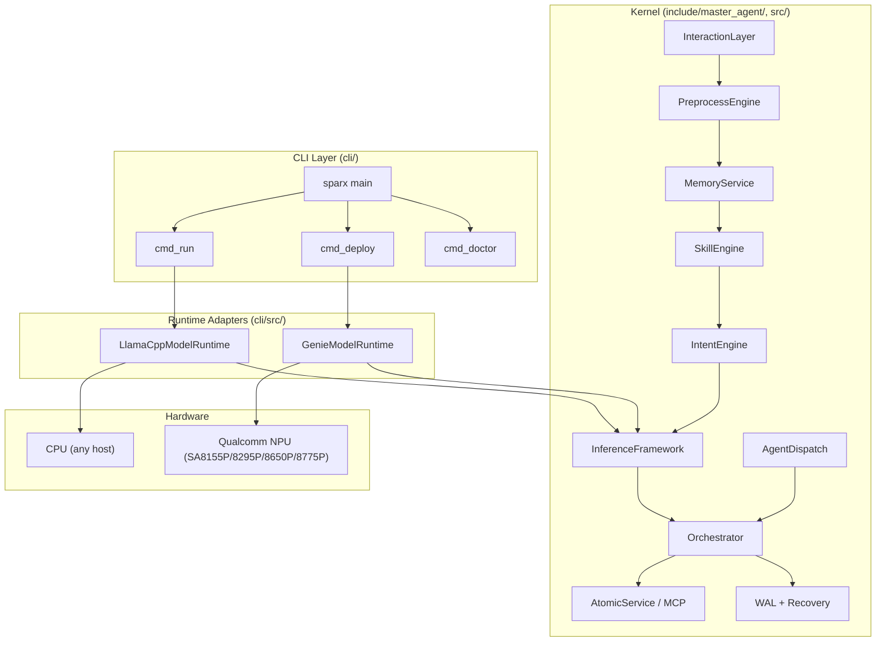
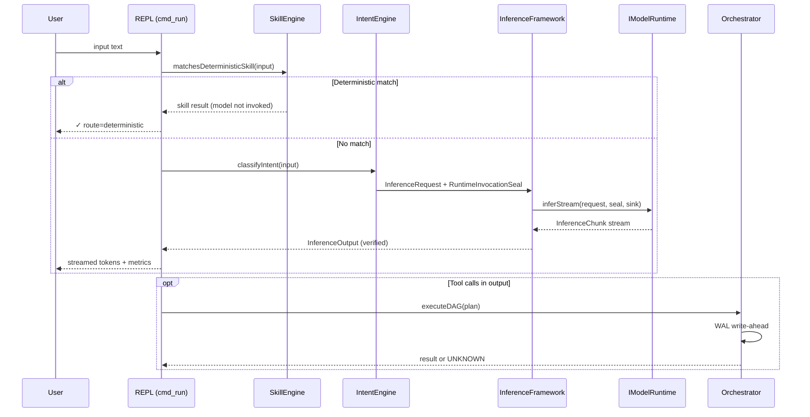
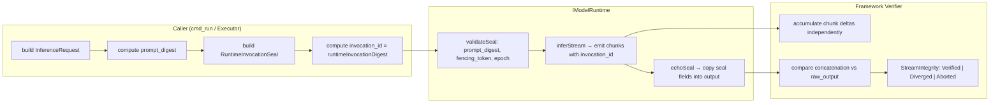
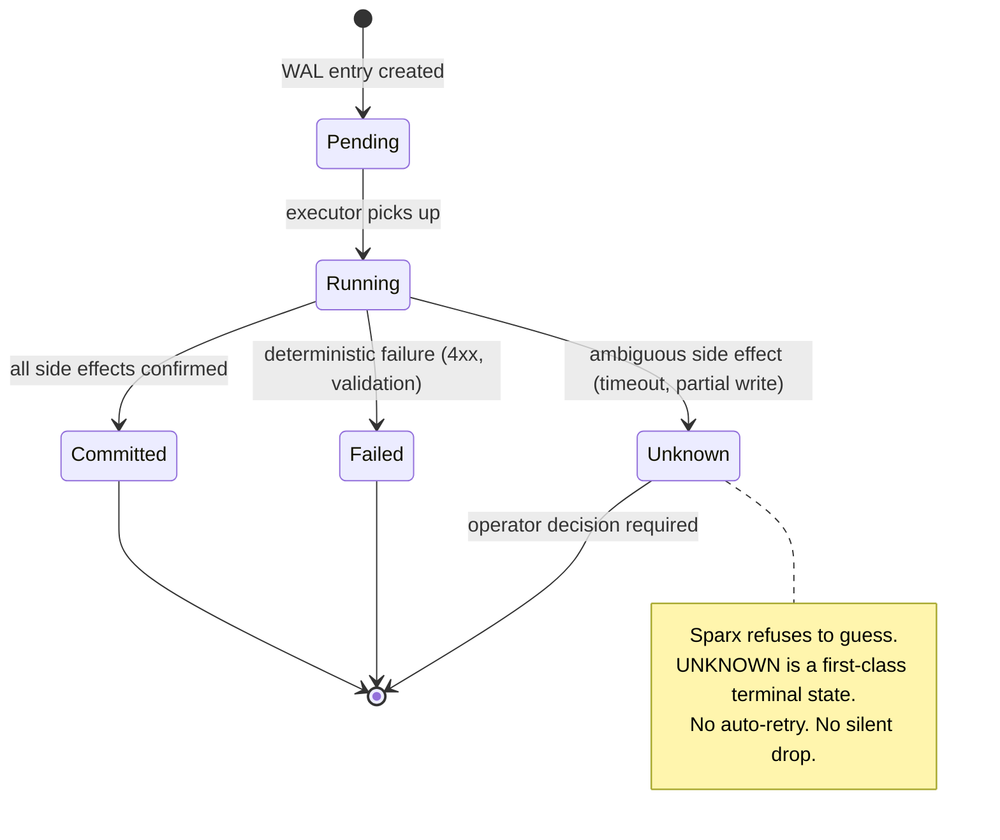
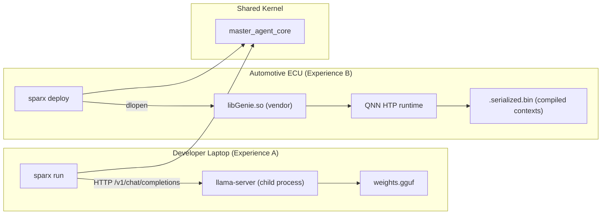
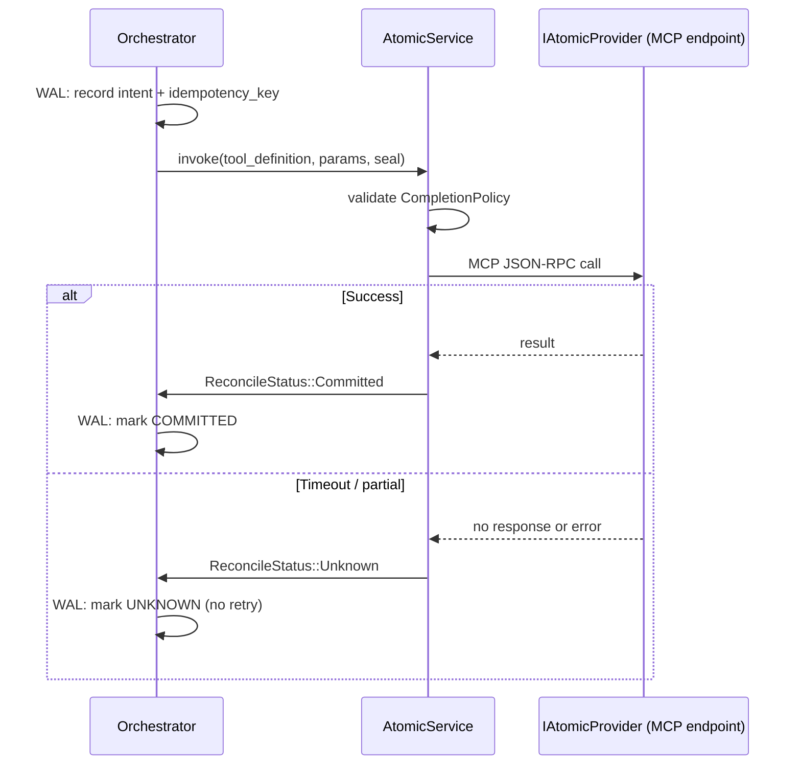

# Sparx Architecture

> 中文版见下方 / Chinese version below

This document describes the internal architecture of Sparx at the level a
contributor or integrator needs. The README has a simplified overview; this is
the real map.

---

## System Layers

---

## Request Flow (single turn)

---

## Inference Trust Model

The framework never trusts a runtime's self-reported output. Every inference
passes through a **seal + digest** contract:

**Key invariants:**
- A chunk whose `invocation_id` does not match the seal is rejected (stale/misrouted).
- `prompt_digest` must match between request and seal — prevents a replay from a different prompt.
- `fencing_token` + `replica_epoch` prevent split-brain when multiple replicas exist.
- The framework's `StreamIntegrity::Verified` means it independently confirmed the concatenated stream matches `raw_output`. A runtime cannot lie about what it streamed.

---

## WAL and Terminal States

---

## Runtime Topology

**Experience A** needs only a GGUF file and (optionally) a pre-built `llama-server`.
The runtime spawns it as a child or attaches to one already running.

**Experience B** requires Qualcomm-licensed artifacts that cannot be redistributed.
`sparx doctor` validates device readiness before deploy.

---

## MCP Service Invocation

---

## Build Targets

| Target | Type | Contents |
|--------|------|----------|
| `master_agent_core` | STATIC | Kernel: orchestrator, inference framework, MCP, WAL, dispatch |
| `sparx_runtimes` | STATIC | `LlamaCppModelRuntime` + `GenieModelRuntime` |
| `sparx` | EXECUTABLE | CLI commands, links both libraries above |
| `test_*` (×15) | EXECUTABLE | Unit + integration tests per subsystem |

---

## 中文版：Sparx 架构设计

### 分层结构

| 层 | 目录 | 职责 |
|----|------|------|
| CLI 层 | `cli/` | 开发者交互入口：`run`, `deploy`, `doctor`, `init`, `demo` |
| 运行时适配层 | `cli/src/*_runtime.cpp` | 将硬件差异封装为统一 `IModelRuntime` 接口 |
| 内核层 | `include/master_agent/`, `src/` | 编排、推理框架、WAL、MCP、意图引擎 |
| 硬件层 | — | CPU (llama.cpp) 或 Qualcomm NPU (Genie/QNN) |

### 核心设计决策

1. **确定性优先路由** — 80%+ 请求无需调用模型。SkillEngine 基于关键词/规则匹配，
   命中即返回，延迟 < 1ms。只有未命中的请求才进入推理路径。

2. **Seal 信任模型** — 运行时不可自证输出正确性。框架独立累积流式 chunk 并与
   `raw_output` 比对，`StreamIntegrity::Verified` 表示框架确认了一致性。
   运行时无法谎报它流出了什么。

3. **Unknown 终止态** — 当侧效应不确定时（超时、部分写入），WAL 标记为
   `UNKNOWN` 而非自动重试。这是业界首个将"不知道"作为正式终止态的 Agent 框架。
   这比虚假的 SUCCESS 更安全——不会重复扣款、不会重复下单。

4. **单二进制、双体验** — 同一个 `sparx` 二进制在笔记本上用 llama-server
   提供 CPU 推理（Experience A），部署到车机时通过 dlopen 加载 libGenie.so
   使用 NPU（Experience B）。内核代码完全共享。

5. **Fencing Token + Epoch** — 防止脑裂。当多个 replica 存在时，只有持有
   最新 fencing_token 且 epoch 匹配的调用才能提交结果。过期的 seal 被
   fail-closed 拒绝。

### 与竞品的架构差异

| 维度 | Sparx | LangChain/AutoGen | 云端 Agent |
|------|-------|-------------------|-----------|
| 部署位置 | 端侧（车机/手机/IoT） | 服务器 | 云端 |
| 推理延迟 | < 100ms (NPU) | 200-2000ms | 500-5000ms |
| 网络依赖 | 无 | 需要 API | 强依赖 |
| 崩溃恢复 | WAL + Unknown 态 | 无 | 依赖云服务 |
| 流式验证 | 框架独立比对 | 无 | 无 |
| 隐私 | 数据不离设备 | 发送至 LLM 提供商 | 发送至云端 |
